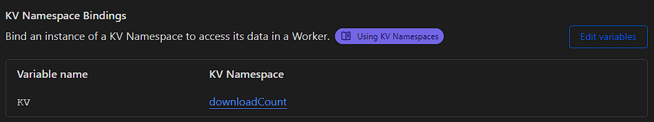

# WorkerDownloadRecorder
## A simple cloudflare worker, that records download numbers
### Install:
-  Clone repo 
- Install dependencies
- Run `wrangler deploy`
- Attach a KV to this worker (see below)

 
 ### Usage:
 - Change your download links to `https://Your.Worker.workers.dev/reder?url=`GH_Username/Repo 
 E.G: download.niceygy.worker.dev/reder?url=niceygylive/niceygylive.xyz
 - It will record the download, then redirect the user to github.com/GH_Username/Repo/releases